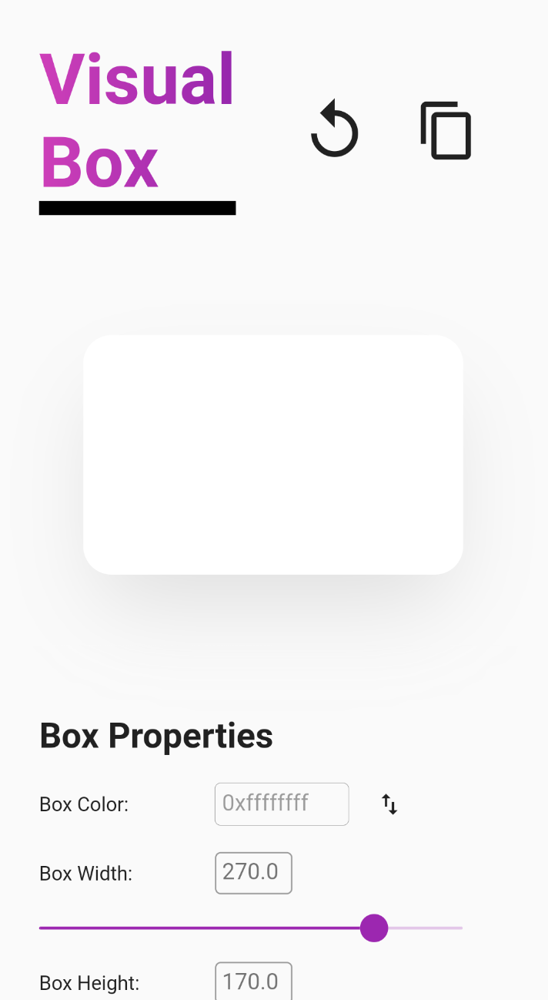

# Box Visualizer

A super simple real-time Box Shadow emulator that follows the syntactical rule of Flutter in generating the Box Shadow

## Screenshots

  
  

## TO-DO
- [ ] Save configuration
- [ ] Copy configuration into Flutter code
- [ ] Default to specific properties only 
- [ ] Color picker
- [ ] Validator for the TextField (they're all disabled atm)
- [ ] A better design. It looks so fugly right now
