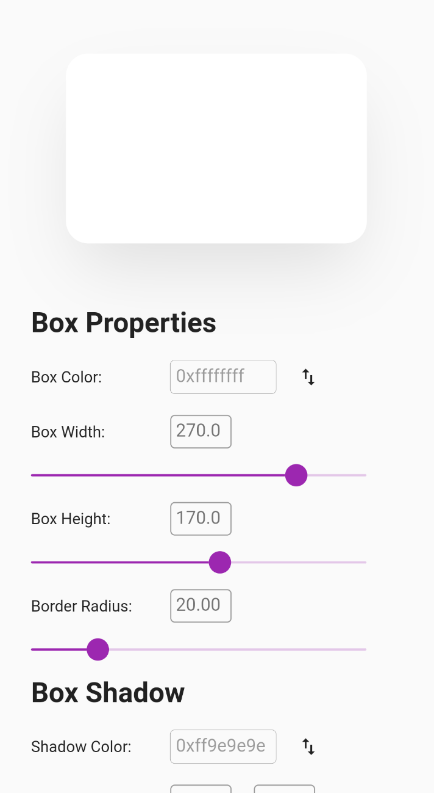
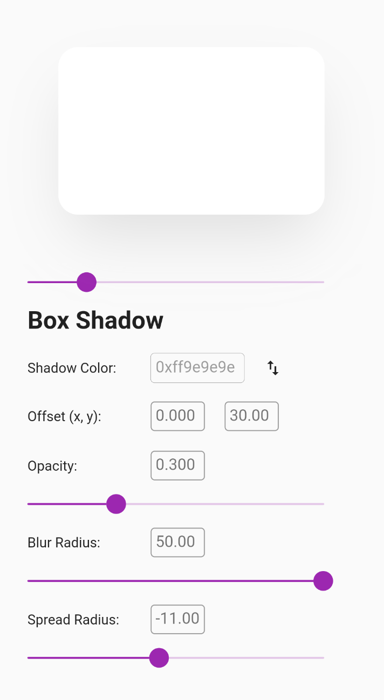

# Box Visualizer

A super simple real-time Box Shadow emulator that follows the syntactical rule of Flutter in generating the Box Shadow

## Screenshots

  
  
  

## TO-DO
- [ ] Save & Load configuration
- [ ] Copy configuration into a Flutter code
- [x] Model Box stays fixed after scrolling down some amount (via StickyHeader())
- [ ] Color picker
- [x] Validator for the TextField (they're all disabled atm)
